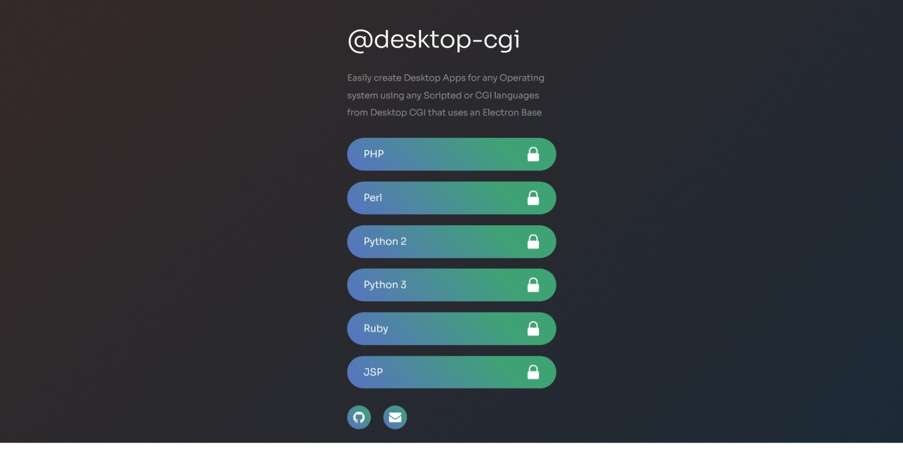

# desktop-cgi
Desktop-CGI is a desktop executable app that can be created from any CGI files or CGI web apps that can be served from an file, an embedded web server using proxy, or an remote proxy web server. It supports embedding and managing embeddable databases and executables. It supports all major Operating systems supported by electron like Windows, Linux, and MacOS supported by Electron. 

`[Funding Invited]`

`[Team and Community Managers Invited]`

# Highlights

Desktop-CGI can serve any CGI files, OR CGI / Scripted / Interpreted languages like `PHP`, `Ruby`, `Python`, `Perl`, `JSP`, `ASPX`, `Other Interpreted` Languages through `embedded webservers` (along with `embedded databases` or `embedded executables`), OR any `remote proxy` (any protocol / webserver) apps using the `cgifiles`, `processes`, and the `proxy` modules respectively. 

Desktop-CGI runs an Electron - Node - Express based application under the hood and supports major Operating systems like Windows, Linux, Mac or any operating systems supported by Electron.

# Setup Desktop-CGI [IN DEVELOPMENT]

* Generate the `executable using shell scripts`
    * Download and Install Dependencies using `shell` scripts
    * Run the `setup.bat` or `setup.ps1` in Windows or `setup.sh` in linux/ mac to download dependencies and set up the repository
        * Following steps are run when the setup shell command is run
            * Install `node.js` from [https://www.nodejs.org](https://nodejs.org/en/download/).
            * (A) `Golang` for `wails` based, (B) `Rust` for `tauri` based, and (C) `nodejs` and `electron` for `electron` based
            * Other dependencies
                * For [base-electron](https://github.com/desktop-cgi/base-electron): Install [dependencies](https://github.com/desktop-cgi/base-electron/blob/a885d410503438e01a86758a67fe65f04b580091/readme.install.dependencies.links.txt) 
                * For [base-wails](https://github.com/desktop-cgi/base-wails): Install GoLang and [dependencies](https://github.com/desktop-cgi/base-wails/blob/14f76e6aa99c3bb641ed1ac174eb6ca2a07ff9eb/readme.install.dependencies.links.txt) 
                * For [base-tauri](https://github.com/desktop-cgi/base-tauri): Install [dependencies](https://github.com/desktop-cgi/base-tauri/blob/ebdc2cc29502518ab0e60b60bafbe21c4f5fe546/readme.install.dependencies.links.txt) 
            * Clone the [Git repository](https://github.com/desktop-cgi/desktop-cgi) (Alternatively, download the git repository)
            * Change to the git repository directory / folder `cd path/to/desktop-cgi` from command line / shell / powershell
            * Setup the repository for creation of executables with all needed dependencies
    * Run the `genexe.bat` (win) or `genexe.sh` (linux/ mac) with its arguments as needed for `www`, `config` folder and `other arguments` to generate the executable as needed
* Generate the `executable using docker command`
    * Run the `docker` run command with its arguments as needed for `www`, `config` folder and `other arguments` to generate the executable as needed

<!-- * Run command `npm install`
* Add your application in the respective `www` folder or sub-folder [TODO - Simplify]
* Check and modify `server/config/config-**template**.json` file for your application's configuration needs
* Check if your electron app runs using command `npm run electron`
* Run command `npm run electronbuild` [TODO - Simplify]
* [Demo] A demo app is placed in the folder [www\demoapp](./www/demoapp) -->

# Functionality Details

The Desktop-CGI based executable can be created using `electron`, `wails` (todo), and `tauri` (todo) and your own web application made from any web scripting language of your choice.

* You should be able to run all files created from `php`, `aspx`, `jsp`, `nodejs`, `python`, `ruby`, `perl` or other scripting languages of your choice using the `cgifiles` definition section of the config file. 
* You should also be able to run and manage other executable binaries like `web server`, `message queues` or `databases` for any of your requirements using the `processes` definition section of the config file. 
* It pipes web applications created from `php`, `aspx`, `jsp`, `nodejs`, `python`, `ruby`, `perl` or other scripting languages of your choice using a embedded web server of your choice using the `processes` definition section of the config file. 
* If your web application is a binary executable that serves an entire web application and web server on its own like `golang`, `c++`/ `c`, or a `java` based executable the Desktop-CGI can manage this as an embedded binary using the `processes` and the `proxies` definition sections of the config file. 
* Creation of an `electron` or `wails` based executable can be as simple as creating your `config.json` file, specifying the `www`, `binaries` resources folder, and running the `genexe` script or `docker` command. 

##### Desktop application runs a CGIJS based CGI serving Server whether using a `Electon`, `Wails`, `Tauri` based base

* Desktop-CGI uses any nodejs framework along with `cgijs` to serve any `CGI` file, `web apps`, `local`/ `remote` `proxies` to create a native-like desktop executable. 
* `cgijs` is Nodejs package which is framework independent / agnostic for serving CGI or interpreted scripting apps via files, or server based web apps via proxies. 
    - `Express` Recommended and used for demo.
    - Any other Nodejs framework like `nextjs`, `koa`, `fastify`, etc can be used to create similar `cgijs` based applications. `cgijs` is framework `independent` and `agnostic`. 
* Run any script files that supports CGI based file script serving - using `cgijs file` module
* Run any host that serves a web app - using `cgijs proxy` module
    - In App / Local / Remote proxy support
* Allows
    - running multiple interpreters in one app
    - running multiple proxies (currently `http`, `websockets`. Other protocols like `tcp`, `udp`, `grpc`, `sockets` planned) in one app
    - multiple embedded servers in one app
* Allows embedding servers like `httpd`, `nginx`, etc to serve web applications - using `cgijs process` module
* Allows embedding database servers (in development) - using `cgijs process` module

##### The script should pipe all interpreted language files below:

* Python (2.x, 3.x)
* Perl (Version Independent)
* PHP (Version Independent)
* Ruby (Version Independent)
<!-- * .NET (Version Independent) -->
<!-- * JSP (Version Independent) -->

##### The script will pipe all proxies of above languages and following (to be tested):

* Jsp (With Tomcat embedded)
* Aspx (Version Independent - With local IIS proxy, Apache embedded)
* Any app using local / remote proxy (currently http, websockets. tcp, udp, grpc, socket planned)

##### The script should currently allow embedding following servers for proxy [TODO: In Development]:

* Apache HTTPD (Allows Embed & Proxy)
* Apache TomCat (Allows Embed & Proxy)
* Nginx (Allows Embed & Proxy)
* Mongoose http server (Allows Embed & Proxy)

The script can proxy to any File, most embeddable web servers, and/ or Proxy-able local / remote servers; even IIS Server (Allows Proxy)

##### Note:

##### Package Dependencies:

* Library dependencies:
    - Nodejs: (> 8.x)

* Application Dependencies:
    - cgi-js: (>=1.1.0)
    - electron": (>=18.1.0)
    - relevant compiling packages

* Application Demo Dependencies:
    - body-parser: (>=1.20.0)
    - ejs: (>=3.1.7)
    - express: (>=4.18.0)
    - fsevents: (>=2.3.2)
    - socket.io: (>=4.5.0)
    - ws: (>=8.5.0)

##### Usage Demo:

Check `index.js` and `server` folder for demo code

# Technical Specifications

...  * Technical specifications to be added

# Wiki

...  * Wiki link to be added

# Status

    In active development
You can track development status here [desktop-cgi/projects](https://github.com/orgs/desktop-cgi/projects/2)

# Open Unmoderated Communities

[Facebook](https://www.facebook.com/groups/732258757997109), [Quora](https://desktopcgi.quora.com/), [Github Discussion](https://github.com/desktop-cgi/desktop-cgi/discussions)

# Issues and Contributions

[Raise an Issue or Contribute](https://github.com/desktop-cgi/desktop-cgi/issues). Active Contributors are invited.

# Todo

Check file - [.todo](https://github.com/desktop-cgi/desktop-cgi/blob/main/dev_support/todo/.todo)

# References

[Electron Application Distribution](https://www.electronjs.org/docs/tutorial/application-distribution)

[Wails Application Distribution](https://wails.io/docs/gettingstarted/building)

[Tauri Application Distribution](https://tauri.app/v1/guides/distribution/publishing)

# License

The MIT License (MIT) - See [LICENSE](./LICENSE) for further details

Copyright © 2019 - till library works:
    Ganesh B <desktopcgi@gmail.com>

The project is intended to be maintained seriously.
<!-- Consider latest version feature: https://api.github.com/repos/DEDAjs/deda-service-manager/releases/latest -->
